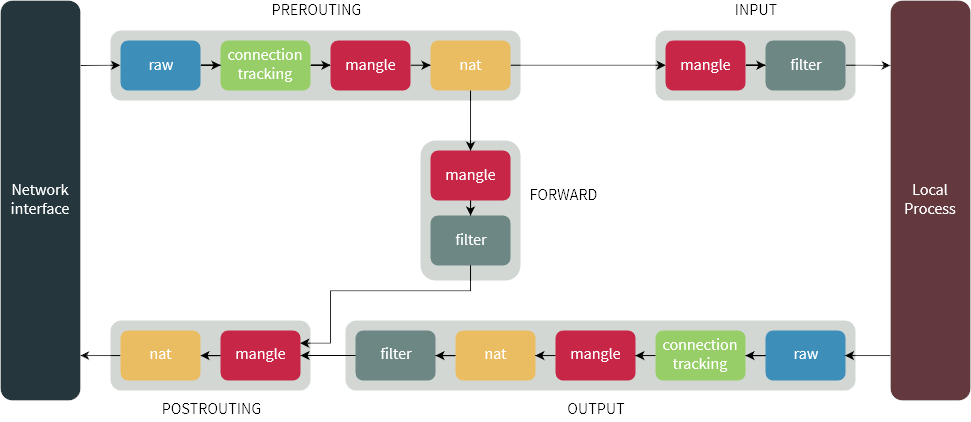

这篇文章深入地探讨了Linux的防火墙iptables的使用方法。主要内容参考自[An In-Depth Guide to iptables, the Linux Firewall - Boolean World](https://www.booleanworld.com/depth-guide-iptables-linux-firewall/)。

<!--more-->

## iptables如何工作

iptabels是netfilter包过滤系统的命令行界面。本文中用iptables统称iptables及netfilter。

iptables有3种结构组成表（table）、链（chain）和目标（target）。表可以被用于指定处理包的方法，默认的表是`filter`，也有其他的表。

链归属于某个表，链被用于检查匹配一些包，并将它传给一个目标。目标决定了包的命运，例如接受或拒绝。

iptables会在链中逐一匹配规则，如果规则匹配了，就会跳转到对应的目标。否则，改链的默认政策（default policy）会被使用。默认政策也是一个目标。所有链的默认政策默认是接受。

### 表

在现代Linux中，有四张表：

- `filter`：最常见的表，用于过滤包。
- `mangle`：用于该表包的头，如TTL信息。
- `nat`：允许通过修改包的目标和源构建NAT网络，如将内网的服务暴露给公网。
- `raw`：iptables是一个有状态的防火墙。`raw`表使得你能够在内核追踪状态前，处理一些包。你也可以使某些包免于状态追踪。

除此之外，一些内核有别的表。如SELinux有`security`表。

### 链

某个表由几个默认的链组成。它们可以使：

- `PREROUTING`：应用于刚从网络上抵达的包，出现在`nat`、`mangle`和`raw`表中。
- `INPUT`：应用于即将抵达本地进程的包，出现在`mangle`和`filter`表中。
- `OUTPUT`：应用于本地进程产生的包，出现在`raw`、`mangle`、`nat`和`filter`表中。
- `FORWARD`：应用于略过主机的包，出现在`mangle`和`filter`表中。
-`POSTROUTING`：应用于即将从网络上离开的包，出现在`nat`和`mangle`表中。



### 目标

一些目标是终结的，也就是说它们立刻决定了包的命运。常见的有：

- `ACCEPT`：iptables会接受该包。
- `DROP`：iptables会丢弃包，就好像系统未曾接收到包。
- `REJECT`：iptables会拒绝包，对于TCP会发送connection reset，对于UDP和ICMP会发送destination host unreachable。

另一些目标是非终结的。例如`LOG`目标，用于输出包的信息到内核日志。

此外你也可以创建自定义的链。

## 关于iptabels命令的一点说明

有两种网络协议，IPv4和IPv6。这两个协议是不同的，因而iptables为IPv4
提供了`iptables`命令，为IPv6提供了`ip6tables`命令。

这两个命令接受的参数差别不大。此外你需要以root身份运行这些命令。

## 屏蔽IP

屏蔽59.45.175.62发来的包可以采用下面的命令：

```bash
iptables -t filter -A INPUT -s 59.45.175.62 -j REJECT
```

`-t`参数指定规则在哪个表中，`-A`参数是说在哪个链的最后添加。`-s`是指定源IP，`-j`是说跳转到哪个目标。

`-t filter`可以省略，因为`filter`是默认表。

也可以采用[CIDR记号](https://en.wikipedia.org/wiki/Classless_Inter-Domain_Routing)指定源IP，类似`-s 59.45.175.0/24`。

类似地，屏蔽前往`31.13.78.35`的包：

```bash
iptables -A OUTPUT -d 31.13.78.35 -j DROP
```

## 列出规则

使用`-L`开关可以列出某个表中的所有链和规则，使用`--line-numbers`可以标记行号。你也可以用`-t`指定显示哪个表。

iptables会对IP采用DNS查询。这通常是不必要，且使命令缓慢。使用`-n`开关可以组织这个行为。

## 删除规则

将`-A chain`命令替换成`-D chain`命令就可以删除规则。此外，`-D chain rulenum`还可以接受第二个可选的参数，就是行号，可以用于删除指定行的规则。当你删除规则时，其后的规则行号会减少，所以一般从后往前删除规则。

使用`-F [chain]`后面跟链名，可以删除该链的所有规则。

## 插入和替换规则

使用`-I chain [rulenum]`命令可以插入规则到最开始或者指定的行号，行号从1开始计数。也可以使用`-R chain rulenum`命令替换掉某个行的规则。

## 协议和模块

使用`-p proto`可以指定匹配的协议，如`tcp`、`udp`和`icmp`（对于IPv4）或`ipv6-icmp`（对于IPv6）。

通过`-m match`可以加载模块，使得之后的命令可以有额外的匹配选项。如`tcp`模块提供了`--dport`可以用于到目标端口的包。一个完整的例子如下：

```bash
iptables -A INPUT -p tcp -m tcp --dport 22 -s 59.45.175.0/24 -j DROP
```

`multiport`模块提供了`--dports`可以同时指定多个逗号分隔的端口。`icmp`提供了`--icmp-type`可以指定`icmp`包的类型。

## 连接追踪模块

先前屏蔽某些IP的做法会导致自己也无法访问改IP上的服务，因为那些服务返回给你的包也被屏蔽了。

所以我们需要知道包的状态，因而就有了`conntrack`模块。它有以下的状态：

- `NEW`：第一个创建连接的包。
- `ESTABLISHED`：归属于已创建连接的包。
- `RELATED`：与某个连接相关的包，如FTP的数据连接。
- `INVALID`：状态不合法的包，如资源不足造成的。
- `UNTRACKED`：所有在`raw`表中，跳转到`NOTRACK`目标的包。
- `DNAT`：目标地址被`nat`表更改的包。
- `SNAT`：源地址被`nat`表更改的包。

`--ctstate`接受逗号分隔的状态列表。如下面的两条规则很适合置于`INPUT`链的最开始：

```bash
iptables -A INPUT -m conntrack --ctstate RELATED,ESTABLISHED -j ACCEPT
iptables -A INPUT -m conntrack --ctstate INVALID -j DROP
```

## 修改默认政策

通过`-P chain target`开关可以设置链的默认目标。如：

```bash
iptables -P INPUT DROP
```

## 选择接口

由于iptables要依照链的每个规则处理每个包，这会变得很慢。一些程序会使用lo接口通信。因而可以在`INPUT`链的最开始插入下面的规则提速：

```bash
iptables -A INPUT -i lo -j ACCEPT
```

这里`-i input`指定输入的接口。类似地，也可以在`OUTPUT`链使用`-o output`指定匹配的输出接口。

## 负面匹配

某些命令支持前面添加`!`表示匹配相反的。

## 使用tcp模块屏蔽非法的TCP包

一些tcp包标志的组合是非法的，我们可以通过`tcp`模块阻止这些包。它提供了`--tcp-flags MASK FLAGS`命令，其中MASK是掩码，FLAGS是掩码下需要匹配的标志位。掩码可以为`ALL`表示所有的标志位。下面是一些例子：

```bash
# 屏蔽同时有SYN和FIN标志位的包
iptables -A INPUT -p tcp -m tcp --tcp-flags SYN,FIN SYN,FIN -j DROP
# 屏蔽状态为new，但没有SYN标志位的包
iptables -A INPUT -p tcp -m conntrack --ctstate NEW -m tcp ! --tcp-flags FIN,SYN,RST,ACK SYN -j DROP
```

## 限制包：limit模块

使用limit模块可以限制包的速率。了解limit模块之前我们需要了解令牌桶算法。可以想象一个桶里面装了一些令牌。只有拿到了令牌，一个包才可以顺利通过。桶中的令牌数目有最大限制，当桶没有令牌，包就无法通过。桶每过一会儿会生成一个令牌，当生成的令牌达到最大限制的时候，多余的令牌就会被抛弃。这里，令牌数目的最大限制就是`--limit-burst number`，令牌生成的速率就是`--limit rate[/second|/minute|/hour|/day]`。下面是一个例子：

```bash
iptables -A INPUT -p icmp -m limit --limit 1/sec --limit-burst 1 -j ACCEPT
```

## 每个IP的限制，recent模块

limit模块无法对每个IP做限制。这就出现了recent模块。像下面的例子：

```bash
iptables -A INPUT -p tcp -m tcp --dport 22 -m conntrack --ctstate NEW -m recent --update --name SSHLIMIT --seconds 180 --hitcount 5 --rsource -j DROP
iptables -A INPUT -p tcp -m tcp --dport 22 -m conntrack --ctstate NEW -m recent --set --name SSHLIMIT --rsource
```

首先，第二条命令中，`--set`表示会向`SSHLIMIT`列表中向该IP更新最近访问时间并添加当前访问记录到列表中，而`--resource`是记录源IP，类似地，`--rdest`可以记录目标IP。第一条命令中`--update`是指从列表中读取IP对应的访问，并会更新最近访问时间并添加当前访问记录到列表中（然而后面的第二条命令并不能省略，我也不太清楚为什么），如果改用`--rcheck`则只是读取IP对应的访问，不会更新。这两者的差异就是对于持续性的访问，`--update`会始终拒绝除非有一段冷却时间，而`--rcheck`则是间歇性的可以通过不需要冷却时间。`--seconds seconds`和`--hitcount hits`是搭配`--rcheck`和`--update`使用的，前者表示从最近访问时间前的几秒内搜索对应的访问记录，`--hitcount hits`设置访问记录的匹配数目上限。

## owner模块

owner模块可以根据用户筛选包。它提供了`--uid-owner`来指定用户。

```bash
iptables -A OUTPUT -d 31.13.78.35 -m owner --uid-owner bobby -j DROP
```

## 自定义链

通过下面的命令可以创建一个新链`ssh-rules`：

```bash
iptables -N ssh-rules
```

这时有一个`RETURN`目标，表示回到父链上。同时`ssh-rules`也能作为新的链。此外还可以删除一个链，但这个链必须为空：

```bash
iptables -X ssh-rules
```

## 对包进行日志：LOG目标

`LOG`目标可以输出日志到`/var/log/syslog`或`/var/log/messages`。你可以使用`--log-prefix`可以为日志添加前缀。

## iptables-save和iptables-restore

使用下面的命令来持久化iptables配置：

```bash
iptables-save -f iptables.rules # 保存配置，IPv6使用ip6tables-save
iptables-restore iptables.rules # 加载配置，IPv6使用ip6tables-store
```
