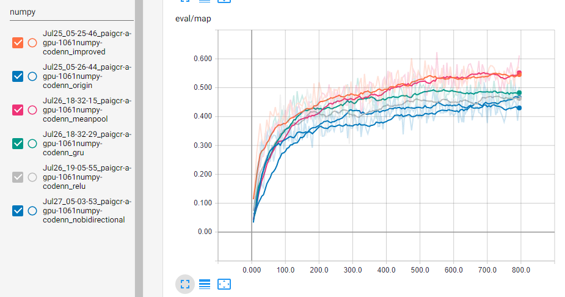
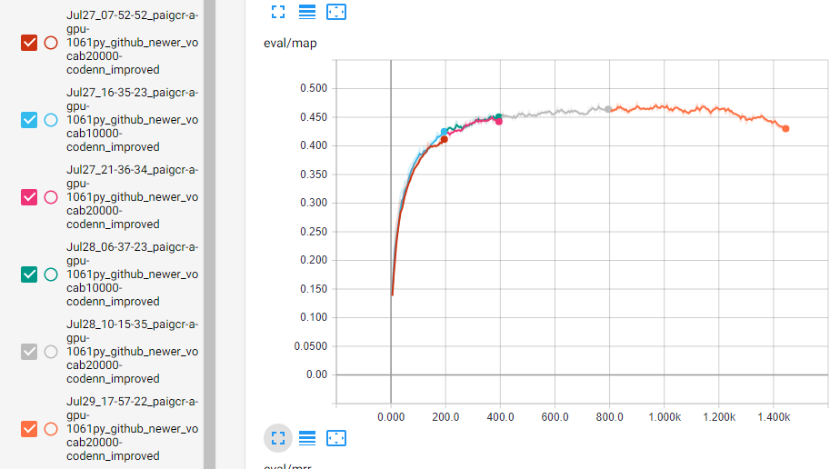

原文由$\LaTeX$编写，点击[此处](/post/microsoft-intern-summary/main.pdf)下载报告原文，点击[此处](/post/microsoft-intern-summary/slides.pdf)下载幻灯片。

<!--more-->

## 实习任务

我们在微软STCA实习的目标是代码搜索，也就是用自然语言查询代码。具体来说，它包含以下几个步骤：1) 收集Python和JavaScript（下简称py和js）的代码库，2) 建立代码搜索的模型（又分为数据预处理、编写模型、训练调参这3个步骤），3) 提供Web服务端以查询py和js的代码，4）编写VS Code插件搜索代码。我们起初也根据搜索语言的不同分组，即py和js两组。但实际上这两个语言的差别仅仅是数据处理，模型是一样的，因而我们两个组是混在一起工作、互相协作的。上述的第4个任务由李超老师完成，而前3个任务就交给了我们。

我们选出冯昊作为我们两个组的共同组长，由他分配任务。我被派的任务是复现CODEnn模型，其他人则负责复现Baseline和Code2Vec模型。而第个任务，即收集代码库也交给了其他人，这是实习第一周完成的任务，而我第一周主要在阅读论文。而后的几乎所有时间几乎都花在了第2个任务，这也是我们这次实习的重点。第3个任务被派给了谭新宇，我和他商量将搜索的请求转发给我，我再返回结果。第3个任务的工作量不大，是在最后一周花费几小时完成的。

除了分配的任务之外，我对代码还有更高的要求，希望代码能更具扩展性，进而实现一个很方便地处理数据、训练评测模型的框架。

## 完成情况

### 数据预处理

每个数据集（即代码库）大致会经历提取代码片段、清洗、切分和转化为输入格式这4个阶段。不同的模型的数据预处理可能只有转化阶段不同，不同数据集的数据预处理又可能只有提取阶段不同，有些数据预处理还可能跳过阶段，这种数据预处理的交互错杂使得维护清晰的数据处理层次变得相对困难。

为了维护清晰的数据处理层次，我经历了1次大重构。最开始我将数据预处理的不同阶段放在不同的目录里，用Makefile自动处理数据。很快地，由于数据集日益复杂，Makefile就很冗长被弃用，进而导致数据处理混乱，不知道上阶段和下阶段数据的位置。此外各个服务器之间同步数据集也是个问题。之后，我重构了整个系统，改用自己写的脚本替代Makefile来批量处理数据，它还可根据参数自动下载处理过或未处理的数据集、根据需要运行依赖。数据集也只分配到了3个目录下面：原始数据集、预处理的、最终用于训练的数据集。数据集的命名也很规范，可以体现上下游阶段的数据集。

### 编写模型

CODEnn相较于BaseLine是一个简单模型，它只需要单步训练。其原理大致是将代码特征映射到一个向量，再将描述文字也映射到一个向量，将其cos距离作为loss训练。对于代码特征，原论文提取了函数名、调用API序列和token集；对于描述文字，通常选取docstring（Python）或函数上方或内部注释（JavaScript）。对于函数名、token集，会按照驼峰命名和下划线命名进一步划分成更小的词法单元，而API序列则保留不再分割。对于token集，不同于其他3种数据（方法名、API序列和描述），我们认为它是无序的（BOW，bag of words），因而进行了去重。所有的这些词素，对于有序的会使用RNN或其变种处理，再将RNN每一个词的输出进行池化；对于无序的，会用MLP（多层感知机，但是论文作者其实只用了单层）处理再进行池化。所有的代码特征池化得到的特征向量再经过一层全连层，使其维度与描述向量的维度一致，最后以cos距离作为loss。为了便于batch处理这些变长的数据，这些数据会被截断或者填充到某一个长度，截断截尾，填充填后。

我重新实现了CODEnn的代码，从而更好地支持了多卡训练、断点、可视化，并适应了我们的数据集。

### 训练调参

CODEnn有很多超参可以调，如RNN的选取LSTM还是GRU（原作选取LSTM），池化的选取Max还是Average（原作选取Max）、激活的选取RELU还是Tanh（原作选取Tanh）、双向还是单向RNN（原作选取双向）、各种变长数据截断或填充的最后长度、vocabulary大小、embedding大小、representing大小。

由于大数据集上的调参需要较大的时间和资源，我相信在小数据集上表现较好的模型在大数据集上也会表现得很好。所以我选用了GitHub上的Numpy代码作为测试数据集。下图是各个调参后训练的结果，这里有两条蓝线，起初在下方后来在上方的是无bidirectional，另一条是原版，improved是指使用了mean池化、GRU和RELU激活，横坐标是epoch。可以看出使用mean池化、GRU、RELU激活都能对模型有所帮助，而bidirectional很难说有没有帮助。

接着，我们想知道Vocabulary的大小会不会影响模型性能，但小数据集本来就没多少Vocabuary，所以我们就在大数据集上测试，测试结果如下图，这里10000vocabulary的是分成2段训练的，分别是蓝色和绿色，其他则是20000vocabulary的，分成4段，横坐标是epoch。可以看出Vocabulary的选取没有太大的影响，这说明出现频率很低的那些词确实不那么重要。后来为了尝试模型的性能是否会有最高点，我又继续训练20000vocabulary，确实发现模型的性能存在最高点，这提示我们需要加入Regularization方法或者提前终止训练。我们选择800epoch的模型作为最终模型。

下表是该模型的性能。就acc@top k的性能指标而言，CODEnn性能远远优于Baseline和Code2Vec以及后来周展平实现的CodeNet。

| dataset | acc@top 5 | acc@top 10 |
|-|-|-|
| validation set  (pool=200) | 0.806875 | 0.884375 |
| validation set  (pool=800) | 0.621563 | 0.726250 |
| test set  (pool=200) | 0.780667 | 0.860333 |
| test set  (pool=800) | 0.596250 | 0.711250 |

## 收获

### 深度学习

最大的收获可以说是深度学习领域的技能得到很大的长进，主要是2个方面：1) Pytorch的编程能力，2) NLP领域的理论能力。

在参加微软实习的一年多以前，我在龙明盛手下做过一会儿的活，主要是研究迁移学习和哈希（也就是embedding），使用过PyTorch和Tensorflow。由于很长时间没有再在深度学习领域写代码，我已经将PyTorch和Tensorflow忘的一干二净了，而且它们的API也发生了一些改动。另外，由于自己一直在迁移学习和哈希的领域研究，很多其他的神经网络模型并没有接触过，比如循环神经网络，以及在这之上做的Seq2Seq模型等等。这一切就导致了我在实习前，上面提到的两个能力是极度匮乏的。

这次实习，我又重温了PyTorch，而且也发现了原来设计的一些API发生了改变，比如Variable这个类被deprecated了、出现了DataParallel这个新的类。当然这些改变也是喜闻乐见的，它们使得PyTorch的API看起来更加优美。

此外，我用PyTorch复现了CODEnn这个模型，它让我知道了RNN及其变体LSTM、GRU的实现方式和工作原理。为了复现Baseline，我还写了个Code Summarizer的模型，这个模型将输入的代码token流转化为总结的文本流，从中我学习了Seq2Seq模型以及带attention的变种的原理及实现方法。总而言之，我的NLP领域的知识和实践能力都得到了很大的长进。

### 团队合作

微软的团队管理还是很先进的，甚至让刚实习的我有些惊叹。在这之前，我们只有在软件工程的课堂上，而这是我们第一次实践这些。主要有3个方面：1) 冲刺管理，2) PAI分配（GPU服务器），3) Teams协同。

我们会有每日的站立会议（实际上是坐着的）来汇报完成的工作和将要完成的工作。我们经历了1次冲刺，在这1次冲刺里，有很多的任务，任务再分配到每个人。通过这种方式我们分配任务并且管理进度。此外，通过各种图表（如燃尽图），我们可以查看到当前的进度。

还有PAI的GPU管理也是很先进的，虽然我觉得有些不便利，因为之前的我都是在实验室里想用多少GPU就和其他人商谈好，而后占用。但考虑到要多人使用，一些任务需要等待，那就需要个很好的调度系统，PAI就是为此而生的。但我也觉得它有些不便利，比如很难和提交的任务交互、无法在运行时改变GPU数目和无法改变端口映射（这是docker限制的）。总的而言，PAI还是不错的。当然最后也要感谢微软给我们提供了充足的运算资源。

Teams也是一个很方便的软件。我之前在Pony.ai实习使用的是slack。个人觉得这两个软件在功能上相仿，而且也处于同样的生态地位。在Teams上交流相比微信便利很多，降低了沟通的瓶颈。

## 感谢体会

首先我要谢谢我的各位导师们，包括但不限于李超、林武桃，它们给予了我很大的帮助。然后我要感谢我的同学们，感谢他们与我协作完成了这个项目。接着我要感谢我在微软的同写字间的其他两个室友，他们为我解答了很多困惑。最后我要感谢微软和学校，微软为我们提供了很多很好的设备，而学校则为我们提供了这么好的一次机会。

除了上面说的这些收获，我也有遗憾，那就是时间太过仓促。我还想尝试很多其他模型，并将它们集成进我的仓库。但时间不允许。总的而言微软的实习是很有意义的它让我学到了很多。
