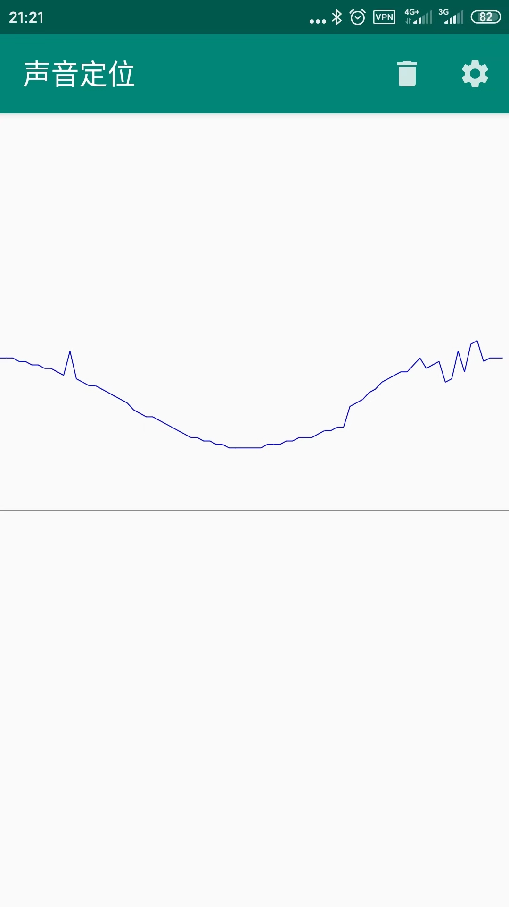
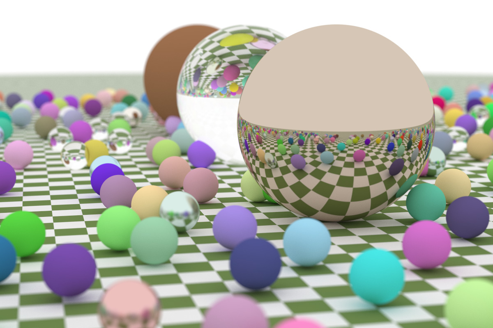

**流量预警！！！** 这篇文章是我参与的项目的汇总。

<!--more-->

## 扫雷作弊器



- 依赖：Windows API
- 语言：C++
- 代码量：586行
- 源码：[sunziping2016/WinminePlugin](https://github.com/sunziping2016/WinminePlugin)

这个项目是我高一的时候用OllyDbg调试扫雷，偶然发现其全局变量与答案之间的关系，因而实现作弊的一个软件。这个软件会从外部读入一个配置文件，选项包括软件的延时、解决的模式（全部解出还是只标出雷）等等，然后借助Windows API读取/修改扫雷的内存。项目的代码是在我初步了解了C++的面向对象机制后写的，作为最初的尝试，其代码结构还有待改进。

## Nokia复式记账软件

- 依赖：[PyS60](https://garage.maemo.org/frs/?group_id=854)（平台为s60v3）
- 语言：Python2
- 代码量：2059行，46个类，298个函数
- 源码：[sunziping2016/NokiaCash](https://github.com/sunziping2016/NokiaCash)

这个项目是我高二的时候为了记账而写的第一个大型应用。这个应用支持复式记账、多文档视图、智能的交互、自动结账、多语言、撤销重做等等。这个项目经历了一次彻底的重构，而这应该是第2版。其代码风格很好地利用了面向对象的优势，简洁而又灵活。这款软件一直被我使用直至我Nokia E71退休。所有的代码都是在我的Nokia E71完成的。

在这前后，我还写过一个走迷宫的游戏，也算是个不小的项目，但代码已经遗失，便不在这里展示。

## 平板跑酷游戏



- 依赖：Windows API
- 语言：纯C
- 代码量：3552行
- 缘由：大一上《软件工程（1）》大作业
- 源码：[sunziping2016/Escape](https://github.com/sunziping2016/Escape)
- 文档：[设计文档](./escape-the-deadline.pdf)

《Escape the Deadline》是一款采用物理模拟的跑酷游戏。所有的游戏场景均从文件读取。游戏中，若玩家与地面碰撞，将失去所有垂直于地面的动量分量。玩家的跳跃以垂直于地面方向的冲量实现。玩家不能在空中控制。目前实现了三个地图。第一个地图为无限随机的跑酷地图，强制向右卷屏。第二个地图的重力加速度较小（这使得玩家可沿着墙壁向上爬行），地图有限，当玩家高度低于-5000时才会死亡，此地图考验技术。第三个地图为空白地图，玩家可进入命令模式后手动绘制（进入命令模式务必确保输入法为英文模式。按住shift再按单引号）。由于使用纯C，整个代码都是面向过程的，使用了模块化设计。

## 联网井字棋



- 依赖：Java运行环境
- 语言：Java
- 代码量：713行
- 缘由：《Java语言程序设计》第九次作业
- 源码：[sunziping2016/Java-TicTacToe](https://github.com/sunziping2016/Java-TicTacToe)

这个项目分服务端和客户端。服务端会将相邻的两个连接作为一组游戏，支持同时多组游戏。客户端依次落子下井字棋。

## 联网贪吃蛇

- 依赖：Java运行环境
- 语言：Java
- 代码量：2864行
- 缘由：《Java语言程序设计》大作业
- 源码：[sunziping2016/Java-snake](https://github.com/sunziping2016/Java-snake)
- 文档：[设计文档](./java-snake.pdf)

这个项目分为服务端和客户端。其架构进行了精心设计，使用了MVC设计模式，但最后客户端因为时间问题草率手工。服务端还有一个简易的用户管理机制。

## Qt植物大战僵尸



- 依赖：Qt
- 语言：C++
- 代码量：4465行
- 缘由：《程序设计实训》大作业
- 源码：[sunziping2016/Qt-PlantsVsZombies](https://github.com/sunziping2016/Qt-PlantsVsZombies)
- 文档：[说明文档](./qt-plants-vs-zombies.pdf)

这是一款使用Qt，模仿植物大战僵尸的游戏。虽然只有一关，可选的植物和僵尸也不多，但是代码非常具有扩展性。有火炬树桩、南瓜头、寒冰射手等植物。

## 知乎搜索引擎



- 依赖：Electron（前端）
- 语言：C++（内核）、JavaScript（前端）
- 代码量：3504行（内核）、463行（前端）
- 缘由：《数据结构与算法（1）》的《数据结构》课程实验2
- 源码：[sunziping2016/zhihu-search-engine](https://github.com/sunziping2016/zhihu-search-engine)
- 文档：[实验报告](./zhihu-search-engine.pdf)

这项作业要求手写各种数据结构、解析给定的HTML、使用前缀树分词、建立倒排索引从而完成对知乎日报文章的检索。我重新实现了C++中的vector、list、unordered_set等数据结构、写了一个具有良好错误检查的HTML解析器，并提供了类似BeautifulSoap的接口。为了加速我使用了多线程。相较于他人动辄1分钟以上的耗时，我仅用1.5秒即可完成这些步骤。前端部分使用Electron，以DLL的方式调用内核，界面模仿了Google。

## 图的可视化



- 依赖：Boost（内核）、Electron（前端）
- 语言：C++（内核）、JavaScript（前端）
- 代码量：1196行（内核）、1502行（前端）
- 缘由：《数据结构与算法（1）》的《图论》大作业
- 源码：[sunziping2016/GraphVisualization](https://github.com/sunziping2016/GraphVisualization)

这个项目使用了Boost图的算法，将其以DLL的方式导出，从而使前端Electron可以调用Boost。前端部分使用了three.js来做到3D的效果。

## 汇编画图



- 依赖：Windows API
- 语言：汇编（RadASM）
- 代码量：2522行（三人组队，我是主力）
- 缘由：《计算机与网络体系结构（2）》的《汇编》小组作业
- 源码：[sunziping2016/asmpaint](https://github.com/sunziping2016/asmpaint)
- 文档：[说明文档](./asmpaint.pdf)

用汇编实现了一个类似mspaint的画图软件。功能非常齐全，包括缩放、撤销重做、矩形椭圆手绘作图、选择前景背景颜色、画笔粗细、填充效果等等。

## FTP服务器

- 依赖：Linux，bcrypt，hash_table
- 语言：C
- 代码量：3011行
- 缘由：《计算机与网络体系结构（1）》的《计算机网络》第一次实验
- 源码：[sunziping2016/ftp-server](https://github.com/sunziping2016/ftp-server)
- 文档：[说明文档](./ftp-server.pdf)

超高性能非阻塞IO的FTP服务器。支持用于添/删服务、添/删用户、踢出客户的CLI界面，支持双栈，支持基于bcrypt用户验证，有良好的信号处理。采用了防御式编程。

## 微信抢票系统

- 依赖：Node.js, MongoDB，Redis
- 语言：JavaScript，Vue
- 代码量：3851行（后端）、6966行（前端）
- 缘由：《软件工程（3）》作业
- 源码：
  - 后端：[sunziping2016/YetAnotherWeChatTicketServer](https://github.com/sunziping2016/YetAnotherWeChatTicketServer)
  - 前端：[sunziping2016/YetAnotherWeChatTicketClient](https://github.com/sunziping2016/YetAnotherWeChatTicketClient)
- 文档：[博客文章：微信抢票]()

这是一个借助微信发布活动、抢票、检票的系统，有邮箱验证的用户权限系统。前后端分离，API设计符合RESTful，有实时消息推送，安全且Scalable，前端为PWA。项目有单元测试，持续集成。

## 云众包平台

- 依赖：Node.js, MongoDB，Redis
- 语言：JavaScript，Vue
- 代码量：5127行（后端，4人协助开发，我的贡献约为1/3）、2946行（接收者前端，我负责）、6257行（发布者前端，车行负责）
- 缘由：《软件工程（3）》大作业
- 源码：
  - 后端：[sunziping2016/crowdsourcing-platform-server](https://github.com/sunziping2016/crowdsourcing-platform-server)
  - 接受者前端：[sunziping2016/crowdsourcing-platform-client](https://github.com/sunziping2016/crowdsourcing-platform-client)
  - 发布者前端：[chehThss/crowdsourcing-platform-publisher-client](https://github.com/chehThss/crowdsourcing-platform-publisher-client)
- 文档：[交付文档](./crowdsourcing-platform.pdf)，[开发文档](https://sunziping2016.github.io/crowdsourcing-platform-server/0.1.0/index.html)

此项目的整体结构与微信抢票差异不大，不再赘述。

## 微信墙&微信弹幕

这个视频录制得有点卡。这是我后来录的，头像和昵称出了点问题。



- 依赖：Node.js，MongoDB，Electron
- 语言：JavaScript，React
- 代码量：1104行（后端），3292行（前端），25行（桌面弹幕）
- 缘由：学生节使用
- 源码：
  - 后端：[sunziping2016/wewall-server](https://github.com/sunziping2016/wewall-server)
  - 前端：[sunziping2016/wewall-client](https://github.com/sunziping2016/wewall-client)
  - 桌面弹幕：[sunziping2016/wewall-browser](https://github.com/sunziping2016/wewall-browser)

这个项目包含微信墙和微信桌面弹幕两部分组成，支持emoji和微信表情。爬虫会模拟登陆微信号管理系统从而爬取用户头像。

## 体感游戏之碰撞

- 依赖：Leap Motion SDK，jBox2d，Java运行环境
- 语言：Java
- 代码量：2455行
- 缘由：科展使用
- 源码：[sunziping2016/Collision](https://github.com/sunziping2016/Collision)

这是一个基于Leap Motion的体感游戏，玩家用手控制游戏中的球，避免被其他的球撞击。架构采用了MVC。

## 小型数据库

- 依赖：ANTLR4，Java运行环境，JUnit5（测试）
- 语言：Java
- 代码量：3774
- 缘由：《计算机系统软件（2）》的《数据库》大作业
- 源码：[sunziping2016/mini-sql](https://github.com/sunziping2016/mini-sql)
- 文档：[演示文档](./mini-sql.pdf)

这是一个简单的关系型数据库实现。支持同时连接多个客户端；客户端服务端都支持命令行参数；对于核心代码有单元测试，可以JOIN任意多张表，支持丰富的表达式及表达式的递归。

## 函数式语言解释器

- 依赖：megaparsec
- 语言：Haskell
- 代码量：1839
- 缘由：《软件理论基础(2):函数式语言程序设计》大作业
- 源码：[sunziping2016/fpproject](https://github.com/sunziping2016/fpproject)

这是一个简单的函数语言解释器，它支持递归函数、ADT、模式匹配、REPL等等特性，文法详见[README.md](https://github.com/sunziping2016/fpproject/blob/master/README.md)。

## 简易操作系统

- 语言：C
- 缘由：《操作系统》大作业
- 源码：[sunziping2016/xv6-improved](https://github.com/sunziping2016/xv6-improved)

这是一个在Xv6基础上继续改进的操作系统，我领导着大组约40人。但最终管理较为混乱。

## 声音通信

- 语言：MATLAB（测试），Android Java（最终实现）
- 代码量：261行（MATLAB），1879行（Java）
- 缘由：《网络系统2》大作业2
- 源码：
  - MATLAB：[sunziping2016/matlab-sound-ofdm-qpsk](https://github.com/sunziping2016/matlab-sound-ofdm-qpsk)
  - Android：[sunziping2016/SoundMessage](https://github.com/sunziping2016/SoundMessage)
- 文档：
  - [报告](./sound-message-report.pdf)
  - [幻灯片](./sound-message-slides.pdf)

声音通过OFDM和QPSK调制方式传输信息。使用循环前缀避免干扰；使用Preamble信号定位其实与终止；最后使用导频信号恢复相位与振幅。开发了既可以作为发送端也可以作为接送端的Android APP。

## 声音定位

- 语言：MATLAB（测试），Android Java（最终实现）
- 代码量：150行（MATLAB），1420行（Java）
- 缘由：《网络系统2》大作业3
- 源码：
  - MATLAB：[sunziping2016/matlab-sound-localization](https://github.com/sunziping2016/matlab-sound-localization)
  - Android：[sunziping2016/SoundLocalization](https://github.com/sunziping2016/SoundLocalization)
- 文档：
  - [报告](./sound-localization-report.pdf)
  - [幻灯片](./sound-localization-slides.pdf)

这个项目采用FMCW的方式进行定位，我实现了1维和2维的实时定位，并且提供了不错的用于调试的UI。2维的定位效果不是特别好。

## Graphviz可视化

- 语言：TypeScript
- 代码量：6682行
- 缘由：专业课程实践导师布置的任务
- 源码：暂时闭源
- 文档：[幻灯片](./graphviz-visualizer-slides.pdf)

这个软件是用于可视化Graphviz文件。它有两个模式，第一个模式采用KamadaKawai作初始布局，紧接着用物理模拟，多体问题采用BarnesHut算法，可以拖拽。第二个模式使用Xdot的输出格式，按照里面的作图信息作图，不可拖拽。

## 全自动刷课脚本

- 依赖：requests/beautifulsoup4（爬虫），PySide2（标注软件），PyTorch（深度学习）
- 语言：Python
- 代码量：1493行
- 缘由：为了抢到英语课
- 源码：[sunziping2016/THUCourseSpider](https://github.com/sunziping2016/THUCourseSpider)
- 文档：[博客文章：全自动清华刷课脚本]()

通过爬虫爬取了4千验证码后，在朋友的帮助下标记了2千验证码。从头设计并训练神经网络，借助CNN和RNN使验证码识别准确率达到了95%。从而做到了全自动无人自动刷课。

## RSA加密

- 语言：Rust
- 代码量：2000行
- 缘由：研一上《应用密码学》期中大作业
- 源码：[sunziping2016/rsa-rs](https://github.com/sunziping2016/rsa-rs)
- 文档：[报告](./rsa.pdf)

借助汇编手写高精度整数，实现了高性能的RSA密钥的生成、加密和解密。借助Rust，代码具有很好的跨平台支持，可在各x86_64平台运行。兼容OpenSSH密钥格式。代码风格良好，搭配单元测试。

## 简易联盟链实现



- 依赖：SQLite
- 语言: Python3（使用Mypy和PyLint），Vue2
- 代码量：2267行（后端）、1264行（前端），我是主力
- 缘由：研一上《应用密码学》期末大作业
- 源码：[sunziping2016/horde-blockchain](https://github.com/sunziping2016/horde-blockchain)
- 文档：
  - [Wiki](https://github.com/sunziping2016/horde-blockchain/wiki)
  - [看板](https://github.com/sunziping2016/horde-blockchain/projects/1)

使用数据库存储区块链，利用实用拜占庭容错协商，适配国密加密算法，可视化地展现了联盟链的操作。数据库和TCP连接均采用异步编程。值得一提的是这个项目在软件工程方面做得比较好，有Wiki帮助成员了解项目、有看板管理现在的任务、有issue追踪需求和bug、有CI对每个commit进行风格检查和单元测试。

## 光线追踪

- 依赖：PyQt5
- 语言：Rust、Python
- 代码量：4842行（Rust内核）、3343（Python前端）
- 缘由：研一下《真实感渲染技术》期末大作业
- 源码：[sunziping2016/ray-tracing](https://github.com/sunziping2016/ray-tracing)
- 文档：[报告](./ray-tracing.pdf)

本项目实现了包含多种材质、多种形状的场景的3D光线追踪。核心逻辑用Rust实现，部分API可被Python前端调用。项目最大的特色在于性能，使用了多线程和基于AoSoA的SIMD加速。代码使用了泛型，可在多种SIMD指令集中方便地切换。

