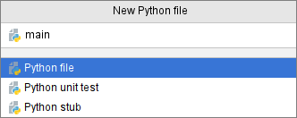
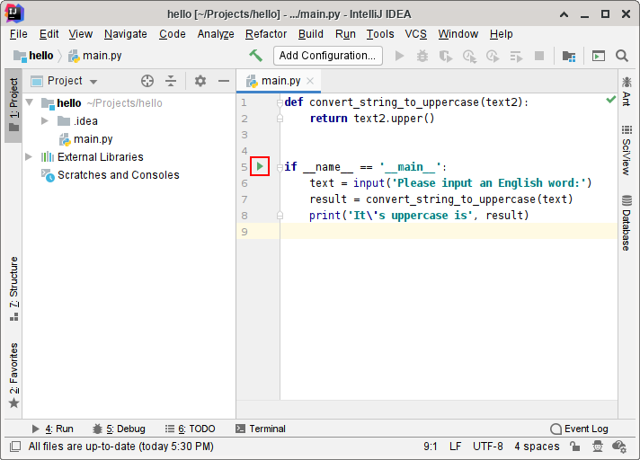
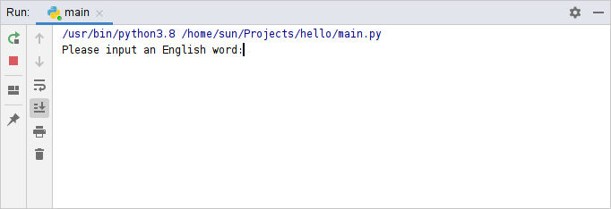

本文是Python教程的第2篇。我们会在第1和第2节分别介绍语句和函数，第3节介绍代码风格，第4节介绍PyCharm IDE的使用，最后1节复习我们所学的知识。这篇教程还有Jupyter Notebook版本，点击[此处](/post/python-tutorial2/tutorial2.ipynb)下载。这篇教程的内容主要来自[4. 其他流程控制工具 — Python 3.7.5 文档](https://docs.python.org/zh-cn/3.7/tutorial/controlflow.html)。

<!--more-->

## 语句

接下来我会介绍一些基本的概念，如果觉得很抽象难以理解，可以先学习后面的部分再回来看。即使不能理解这些概念也不会妨碍编程。

**语句**是构成命令式程序设计的另一个重要组成部分组成，语句之间也可以像表达式一样互相**嵌套**形成复杂的结构。可以包含其他语句作为子语句的称为**复合语句**，如我们接下来会讲的`if`、`while`和`for`，反之称为**简单语句**。

与表达式不同，语句不会产生值，语句的所有意义在于产生**副作用**。副作用有两种情况：

- **修改状态**，比如对变量赋值：如`a = 1`；
- **输入输出**：如`print('hello')`。

在保存运行代码的情况（而非交互模式）下，一个没有副作用的语句，如`1 + 1`，是没有意义的，可以删除，而且这通常是一个潜在的错误。

接下来我来介绍2种我们接触过的语句：

- **表达式语句**：单独一个表达式可以形成语句，称为表达式语句，如刚才提到的`1 + 1`和`print('hello')`都是表达式语句，后者有输出的副作用，而前者毫无作用；
- **赋值语句**：在Python中赋值是一个语句，如`a = 1`，赋值语句的副作用就是修改状态。

传统的**结构化编程**包含以下3种复合语句结构：

- **顺序**：将多个语句挨个写出来，就是顺序结构，程序会依次执行这些语句，下面将给出示例；
- **选择**：根据条件只执行一部分语句，如1.1中的`if`语句；
- **循环**：根据条件重复执行一段语句，如1.2和1.3中的`while`和`for`语句。

这里给出一个顺序执行求$\sqrt{2}$的例子，方法是牛顿迭代法（$x_{n+1}=\frac{1}{2}(x_n + \frac{S}{x})$数列的极限为$\sqrt{S}$），迭代3次，并和直接计算的结果作比较：

```python
a = 2
a = 0.5 * (a + 2 / a)
a = 0.5 * (a + 2 / a)
a = 0.5 * (a + 2 / a)
print('My sqrt is', a)
print('Real sqrt is', 2 ** 0.5)
```

好啦说了这么多（没啥用的），让我们开始学习流程控制语句吧。

### `if`语句

#### `if`示例

先看`if`语句的例子：

```python
x = int(input("Please enter an integer: "))
if x < 0:
    print('Negative changed to zero')
elif x == 0:
    print('Zero')
elif x == 1:
    print('Single')
else:
    print('More')
```

上面的例子中有两个新函数，这边介绍以下：

- `input()`：接受一个可选的字符串参数，打印这个字符串，然后读入一行新的字符串，返回读入的字符串（不包括换行）；
- `int()`：接受一个字符串，返回字符串代表的整数。

所以上面代码的第一行的含义是打印`Please enter an integer:`，读入一行输入，转成对应的整数，将整数存入变量`x`。

接下来的`if`和行末的`:`之间有一个表达式`x < 0`，这里涉及了**布尔类型**和**比较运算符**，我来介绍一下。

#### 布尔类型（bool）

布尔类型是一种只有两个值，代表真假的类型。它有两个字面量：`True`和`False`，分别代表真和假，你可以在交互式命令行输入它们试试看：

```python
>>> True
True
>>> False
False
```

#### 比较运算符（comparison operator）

一共有6种比较运算符，它们都是二元中缀的运算符（接受2个操作数，位于2个操作数中间）。所有的比较运算符都具有相同的优先级且比算术运算符低，返回布尔类型。这6个比较运算符分别是：

- `<`：小于；
- `>`：大于；
- `<=`：小于等于；
- `>=`： 大于等于；
- `==`：等于；
- `!=`：不等于。

这里关于键入这些符号，我有3点提醒大家。首先别在键盘或者输入法中找$\leq$和$\geq$，小于等于和大于等于就是两个字符拼接出来。然后是等于，一定记住是两个等号，一个等号的是赋值。最后也别找$\neq$，记住是`!=`就行。

接下来我来讲解一些比较运算符的操作数类型。显而易见，数值类型（整数和浮点数）都是可以参与比较的，来看看一些运算符计算的示例吧：

```python
>>> 2.0 <= 4
True
>>> 3 > 5
False
>>> 1.0 == 1 # 混合数学类型比较
True
>>> 0.1 + 0.1 + 0.1 == 0.3 # 浮点数的精度丢失问题
False
```

最后两个例子我解释下。首先`1.0 == 1`并不会因为操作数的类型不同而是`False`，实际上，右边的操作数`1`会转换为浮点数，和左边比较得到相等的结果。最后一个例子中，3个`0.1`的和不等于`0.3`可能就会令很多人困惑，这是因为不同于整数，浮点数的精度是有限的，`0.1`实际上约是`0.10000000000000001`，而`0.3`实际上约是`0.29999999999999999`，所以3倍`0.1`就不等于`0.3`。那么我们该如何判断两个浮点数是不是相等呢？实际上我们会对两个数作差，取绝对值后如果小于某个很小的数（这个很小的数习惯叫epsilon），我们就认为相等：

```python
>>> epsilon = 1e-8
>>> x = 0.1 + 0.1 + 0.1
>>> y = 0.3
>>> abs(x - y) < epsilon
True
```

这里我们用到了绝对值函数`abs()`，它接受一个数，返回它的绝对值。

除了数值可以作为比较运算符的操作数，字符串和列表也能参与比较运算，他们的比较涉及一个概念“**字典序**”。对于两串序列而言，我们先比较第1个元素看谁小，如果第1个元素相同就再比较第2个元素，如果最后前缀的元素都相同，但长度不一样，我们就认为短的小。对于字符串，比较的是每个字符的编码值，你只需要记住以下规则就行：0到9是依次递增不夹杂别的字符，A到Z也是依次递增不夹杂别的字符，a到z也同样是。我们来看例子：

```python
>>> 'a' < 'z'
True
>>> 'a' < 'a0'
True
>>> [1, 1] < [1, 0]
False
>>> [1, 1] < [1, 1, 0]
True
```

然后我们讲解一下串连比较运算符。一般而言，我们说运算符会具有结合性，但Python的比较运算符不是这样的。我们先看例子：

```python
>>> -1 < 3 < 2   # -1 < 3 且 3 < 2
False
>>> (-1 < 3) < 2 # True < 2
True
>>> -1 < (3 < 2) # -1 < False
True
>>> 1 < 3 > 2    # 1 < 3 且 3 > 2
True
```

Python的串连比较运算符既不是左结合也不是右结合的，而是很符合数学直觉的一种计算方式。`-1 < 3 < 2`等价于`-1 < 3`且`3 < 2`。而当你加上括号之后，这个魔法就消失了，如`(-1 < 3) < 2`会先计算`(-1 < 3)`得到`True`，`True`转换为数值类型成`1`，而后`1 < 2`得到`True`；或者`-1 < (3 < 2)`会先计算`(3 < 2)`得到`False`，`False`转换为数值类型成`0`，而后`-1 < 0`得到`True`。串联的比较运算符不必是同一种运算符，最后一个例子混用了`<`和`>`，但注意`1`和`2`之间没有任何比较关系。这里的讨论其实涉及了**布尔类型到数值类型的类型转换**，这种类型转换使得布尔类型也可以参与数值计算，我们会在1.1.5介绍其他类型到布尔类型的转换，这使得其他类型也能作为`if`等控制语句的判断条件。

#### `if`语句格式

再看例子：

```python
if x < 0:
    print('Negative changed to zero')
elif x == 0:
    print('Zero')
elif x == 1:
    print('Single')
else:
    print('More')
```

我们先说**语法**，`if`后面和`elif`后面都是跟一个布尔类型的表达式，这是**条件**。`else`后面不需要跟条件。而后，后面跟冒号`:`和换行，换行后必须跟至少一个子语句，子语句必须使用**缩进**（也就是用空格或者Tab使代码往右侧便宜），且同一块的自语句缩进相同。一般我们使用4空格缩进。`elif`部分只能出现在中间，可以有零个或多个，`else`部分只能出现在最后，可以有零个或一个。

然后我们说说**语义**，程序首先检查`if`语句的条件，如果`if`后面的条件成立就执行`if`子句的内容，然后退出`if`语句（不参与之后的条件判断）；否则再比较第1个`elif`（如果有）后面的条件，成立了就执行第1个`elif`子句的内容，然后退出`if`语句，然后再比较第2个`elif`（如果有）的条件，以此类推。如果所有的条件不满足，就会执行`else`子句。

我们来看一些例子。

示例1：若`x`是奇数，将`x`加`1`，省略`elif`和`else`部分。

```python
x = 3
if x % 2 == 1:
    x = x + 1
print(x) # 4
```

示例2：猜猜下面的x是多少？记住一旦进入了某个子句内部执行完毕，就不会再去参与别的条件判断了。

```python
x = 4
if x > 0:
    x = -1
elif x < 0:
    x = 1
print(x) # -1
```

示例3：if语句可以嵌套，上面的示例其实等价于下面的嵌套if语句。实际上`elif`就是`else if`的简称，但由于这种嵌套的写法会使代码缩进得越来越深，所以最终出现了`elif`。

```python
x = 4
if x > 0:
    x = -1
else:
    if x < 0:
        x = 1
print(x) # -1
```

示例4：如果子句只有一条语句，也可以不换行，像下面那样，但可以看出这种写法的可读性不高，所以不建议这么写：

```python
x = 3
if x % 2 == 1: print('x is odd number')
else: print('x is even number')
```

#### 真假值

上一个例子中`x % 2 == 1`其实可以简写成`x % 2`，像下面那样：

```python
x = 3
if x % 2:
    print('x is odd number')
else:
    print('x is even number')
```

这就是因为其他类型可以转换为布尔类型，从而作为`if`语句的判断条件。以下值会被认为是假的，转换成`False`：

- `0`：整型0；
- `0.0`：浮点型0；
- `''`：空字符串；
- `[]`：空列表。

除此之外，我们目前学到的其他类型的值都是真的，会转换为`True`，举个例子：

```python
if []:
    print('[] is true')
else:
    print('[] is false')
if '':
    print('\'\' is true')
else:
    print('\'\' is false')
```

### `while`语句

我们先写个例子打印1到10：

```python
i = 1
while i <= 10:
    print(i)
    i = i + 1
```

`while`语句中间缩进的部分我们称为**循环体**，循环体不能省略。`while`只要条件成立就不会不断执行循环体。如果循环无法终止，我们就称之为**死循环**。

### `for`语句

我们经常需要遍历列表中所有的元素进行操作，如果用`while`，它会是这样的：

```python
words = ['cat', 'window', 'defenestrate']
# 打印每个单词及其长度
i = 0
end = len(words)
while i < end:
    w = words[i]
    print(w, len(w))
    i = i + 1
```

这种时候用`for`循环就方便很多，而且可读性更高：

```python
for w in words:
    print(w, len(w))
```

`for`语句紧跟在`for`后面的是标识符（以后我们可以看到是别的东西），然后是`in`，再然后是一个**可迭代对象**。它会将**可迭代对象**的每个值按顺序赋予`for`和`in`之间标识符，然后在执行循环体。与`while`相同，循环体不能省略。我们接触到的可迭代对象只有2个，字符串和列表，之后会介绍第3个，`range()`。

一般情况下，一边循环一边修改可迭代对象是个错误，这是你可以对可迭代对象做个拷贝（用切片语法），再迭代。就像下面的代码那样，如果你去掉拷贝，将`words[:]`改为`words`会造成死循环：

```python
words = ['cat', 'window', 'defenestrate']
# 将长度超过6的单词拷到尾部
for w in words[:]:
    if len(w) > 6:
        words.append(w)
print(words)
# ['cat', 'window', 'defenestrate', 'defenestrate']
```

#### `range()`函数

有时你只是想要迭代一个计数器，这时候`range()`函数就很有用，它会返回一个可迭代对象。

`range()`可以接受1到3个参数，我们来解释一下这3种情况：

- `range(stop)`：生成一个从0到`stop`（包含0不包含`stop`）的递增序列；
- `range(start, stop)`：生成一个从`start`到`stop`（包含`start`不包含`stop`）的递增序列；
- `range(start, stop, step)`：生成一个从`start`开始的等差序列，其步进（公差）是`step`，如果`step`是正数（负数），直到数列大于（小于）`stop`就终止。

我们看示例：

|`range`表达式|可迭代对象包含的数值|
|-|-|
|`range(5)`|0, 1, 2, 3, 4|
|`range(5, 10)`|5, 6, 7, 8, 9|
|`range(0, 10, 3)`|0, 3, 6, 9|
|`range(-10, -100, -30)`|-10, -40, -70|

让我们看一下示例代码，先是打印1到10：

```python
for i in range(1, 11):
    print(i)
```

再是遍历单词列表，输出它是第几个单词和单词本身：

```python
a = ['Mary', 'had', 'a', 'little', 'lamb']
for i in range(len(a)):
    print(i, a[i])
```

当你只是打印`range`，会出现奇怪的结果：

```python
>>> range(10)
range(0, 10)
```

你并没有看到一串数。因为实际上只有你去把它作为`for`语句`in`后面的可迭代对象时，才会生成这一系列的数，这是为了性能考虑的。有时我们也需要将可迭代对象转换为列表，这时可用`list()`函数。

```python
>>> list(range(5))
[0, 1, 2, 3, 4]
```

### `break`、`continue`和循环`else`子句

先看示例：

```python
for n in range(2, 10):
    for x in range(2, n):
        if n % x == 0:
            print(n, 'is not a prime number')
            break # 跳出最内层（第2个）for循环
    else: # 当for正常结束而非break时执行
        print(n, 'is a prime number')
```

上面的程序用最原始的试除法来判断数是不是素数。`break`语句是用于终止最近的循环的。和`if`一样，`for`和`while`语句也可以有`else`子句，它的含义书如果`for`和`while`不是通过`break`终止的，它就会被执行，否则不执行。此外还有`continue`语句，它用于跳过剩余的循环体，直接进入下一次循环的，如下：

```python
for num in range(2, 10):
    if num % 2 == 0:
        print("Found an even number", num)
        continue # 跳过后面的语句
    print("Found a number", num)
```

### `pass`语句

我们可以注意到`if`、`elif`、`else`、`while`和`for`的子句部分都必须需要语句，如果你什么语句都不想指定的时候，就可以用`pass`语句，它什么事都不做。如下面的死循环的例子：

```python
while True:
    pass
```

#### 关键字（keyword）

学了这么多语句，我们可以注意到一些单词在程序的语法和语义上扮演着特殊的角色，如`if`、`elif`、`else`、`while`、`for`、`break`、`continue`、`pass`、`True`、`False`和我们即将学到`def`及`None`，这些单词我们称之为**关键字**。而另一些词，如`len`、`int`、`print`、`input`、`abs`，它们只是一些实体的名字，我们称之为**标识符**。你可以通过赋值覆盖掉这些标识符原来的含义。当然，你可以给新的实体起名字，如变量名和下面会接触到的函数名，这些名字不能是关键字。我在这里列出合法标识符的命名要求（虽然可以，不建议包含中文）：

1. 不是关键字；
2. 由数字、大小写英文字母和下线符`_`组成；
3. 不能以数字开头。

## 函数

**函数（function）** 可以说是传统命令式编程的最后一个拼图。我们经常会需要将一些功能**模块化**。比如上面的判断一个数是否是素数，就可以写成一个函数，其输入是一个整数，输出是一个布尔值。除了**模块化**之外，函数直接或者间接地调用自己，也很多时候能简化问题，我们称之为**递归**，这会在2.1.4中介绍。模块化和递归是我认为函数最主要的作用。

### 定义函数

你可以像下面那样定义一个函数。

```python
def add(a, b):
    """Add two number."""
    return a + b
```

定义函数的时候，函数并不会被执行，只有在调用时，才会真正执行并根据参数返回一个值。**调用（call）** 这个函数就和调用别的函数那样：

```python
>>> add(1, 2)
3
```

在`def`后面跟上一个标识符作为函数名称，而后跟上括号括起，逗号分割的标识符列表，我们称这些标识符为，**形式参数**，如上面的`a`和`b`。之后的语句从下一行开始，必须缩进，称为**函数体**，如果函数体不需要任何操作，可以用`pass`语句。

最后一行的语句是`return`语句，`return`语句的后面可以跟个表达式，这个表达式的值就是函数的**返回值**，作为函数调用的结果。`return`语句不必存在在函数的最后一行。`return`语句也可以省略后面的表达式，这样等价于`return None`；函数末尾也可以没有`return`语句，也等价于在函数末尾写了`return None`。`None`这个值表示什么都没有。如果在交互界面下，一个表达式的值是`None`，那么什么东西都不会打印出来。看下面例子：

```python
def get(pred):
    if pred:
        return 1
   # 没有return等价于“return None”
```

```python
>>> get() # 缺参数会报错
Traceback (most recent call last):
  File "<stdin>", line 1, in <module>
TypeError: get() missing 1 required positional argument: 'pred'
>>> get(True)
1
>>> get(False) # 什么都没输出，因为返回了None
>>> None # 同样什么都没输出
>>> print(None)
None
```

函数体的第一个语句可以是字符串文本，就像这里的`"""Add two number."""`，我们称之为**文档字符串**（docstring），通常是用3个双引号括住的跨行字符串。它给出函数的一些帮助信息，但不同于注释，它能被Python识别出来，并可以通过`help()`显示出来。`help()`携带一个参数，通常是要查询信息的函数等等，返回它的帮助信息，我们会在之后再讲文档字符串：

```python
>>> help(add)
Help on function add in module __main__:

add(a, b)
    Add two number.
```

接下来我们来细致讲解函数定义的细节、准则和技巧。

#### 形式参数（parameter）、实际参数（argument）与传参方式

正如上文说过的，我们把函数定义中，例如`def add(a, b):`中的`a`和`b`称为**形式参数**，简称**形参**。而我们把函数调用中，例如`add(1, 2)`中的`1`和`2`称为**实际参数**，简称**实参**。但实际生活中我们可能会混用这些称呼，统称为参数。

在Python中，函数调用会发生实参向形参的赋值，你可以认为这是一种浅拷贝，因而在函数体内再对形参的赋值不会作用到函数外部，如下：

```python
def reassign(a, b):
    a = 2
    b.append(3)
```

```python
>>> c = 1
>>> d = []
>>> reassign(c, d)
>>> c # c没有发生更改，因为形参a只是被绑定到了新的值2上
1
>>> d
[3]
```

像上面这种发生赋值的函数调用方式，我们称之为**按值调用（call by value）**。Python的所有函数调用均是**按值调用**。

当然这个世界上还有很多的调用方式，如**按引用调用**，这种方式下，对形参的修改会直接反应给外部。不过这不在我们的研究范围内。

#### 作用域（scope）

每个名字都有它有效的范围，即能获取这个名字的范围，我们称之为**作用域**。如果没有函数，所有的名字的作用域都是很显而易见的，从它定义开始一直到最后。有了函数之后，事情稍微复杂了一些。

我们一般把定义在函数内的变量称为**局部变量（local variable）**，而定义在函数外的变量称为**全局变量（global variable）**，当然啦，如果你没有忘记，还有一类变量叫做**形式参数**。目前我们就学了这3类变量。看下面这个例子：

```python
>>> c = 2
>>> def f(a):
...     b = 1
...     print(c)
...
>>> f(1)
2
>>> a
Traceback (most recent call last):
  File "<stdin>", line 1, in <module>
NameError: name 'a' is not defined
>>> b
Traceback (most recent call last):
  File "<stdin>", line 1, in <module>
NameError: name 'b' is not defined
```

这里`a`是形式参数，`b`是局部变量，`c`是全局变量。

全局变量的作用域从它定义的位置一直到最后，而局部变量的作用域只从它定义的位置到函数体的结尾，最后，形式参数从性质上来讲更像局部变量，它的作用域只在函数体内部。

按照上个例子，`c`是全局变量，所以我们甚至能在函数`f`中引用它，但是函数`f`中的`a`和`b`在外面是访问不到的。

上面我们只是访问了`c`，如果我们试图修改`c`，那情形就更加复杂了，我们来看下面的代码：

```python
>>> c = 2
>>> def g():
...     c = 1
...     print('inside:', c)
...
>>> g()
inside: 1
>>> print('outside:', c)
outside: 2
```

很多人的第一反应是，我们明明对`c`修改了，为什么没有起效呢？这是因为在函数内部的`c = 1`只是创建了个局部变量，它与全局变量同名。要理解这一切的行为，我们需要讲两个规则：

1. 在默认情况下，函数内部的赋值只会创建局部变量；
2. 当需要使用名字（不包含赋值），且有多个同名变量存在的时候，位于最内层作用域的变量被使用。

对于第2点补充一下，你可以理解为当使用一个名字时，我们会从内到外依次去寻找这个变量。所以当我们`print('inside:', c)`的时候，它在局部作用域就找到了`c`，所以打印了`1`。实际上内部的`c`**屏蔽（shadow）** 了外部的`c`。

那有没有什么方法能阻止这个行为呢？答案是有的。只要在赋值发生之前用`global`语句声明变量在全局作用域，就可以使赋值创建或修改全局变量。如下：

```python
>>> c = 2
>>> def h():
...     global c, d
...     c = 3
...     d = 4
...
>>> h()
>>> c
3
>>> d
4
```

其实一开始有些人会觉得作用域的设计带来了很多不方便。但其实这个设计是很合理的。因为函数是对一些操作的**封装**，如果你随随便便修改几个全局变量，就会影响到其他函数的运行，那是有很大安全隐患的。毕竟这么多Python库的作者们才不会互相协调好，哪个名字的全局变量归谁使用。

#### 函数设计准则

可以看出函数像个运算符（或者这句话更准确来说是运算符像个函数），它有参数和返回值。函数除了以这种方式（返回值）或修改参数所指的对象产生作用外，还可以产生**副作用**，即修改全局变量或者输入输出。但是，工程上来讲，我们**希望函数拥有尽可能小的副作用**。实际上全局变量很多时候是万恶的。一开始编程可能觉得没什么问题，但当你程序变得庞大的时候，减少全局变量、函数无副作用（尤其是不要访问修改全局变量）可以使程序逻辑更清晰。

#### 递归（recursion）

在函数中，你不仅能够调用其他函数，你还能调用函数自己，这就被称为**递归**。我们以求阶乘为例，给出递归版本的和非递归版本的。递归版如下：

```python
def factorial(n):
    if n <= 0:
        return 1
    return n * factorial(n - 1)
```

像这样使用：

```python
>>> factorial(5)
120
```

可以看出写递归版基本是无脑的：先考虑边界条件，如果`n`小于等于`0`，那阶乘就是1（`0`的阶乘是1哦）；其他情况$n! =n\times(n-1)!$。

突然你看到了知乎提问[如何编程求10000!（一万的阶乘）? - 知乎](https://www.zhihu.com/question/24151879)，你跃跃欲试，却发现结果是：

```python
>>> factorial(10000)
Traceback (most recent call last):
  File "<stdin>", line 1, in <module>
  File "<stdin>", line 4, in factorial
  File "<stdin>", line 4, in factorial
  File "<stdin>", line 4, in factorial
  [Previous line repeated 995 more times]
  File "<stdin>", line 2, in factorial
RecursionError: maximum recursion depth exceeded in comparison
```

没错，递归是有深度限制的，递归太多次就会出错，那我们老老实实写循环吧：

```python
def factorial2(n):
    prod = 1
    for i in range(1, n + 1):
        prod = prod * i
    return prod
```

这个写法其实也没比递归复杂太多。我们有个累乘变量`prod`，然后生成范围为`[1, n + 1)`的整数，挨个乘上去。现在你可以去知乎，把下面的答案贴上去，说这么简单的问题，5行代码就能搞定。

```python
>>> factorial2(10000)
2846...0000
```

于是乎，如果你真的打开了知乎，你发现高票的Python只有一行（红红火火恍恍惚惚）。其实它少了一行`from functools import reduce`。如果你想知道这是怎么回事。你可以看完下面的高阶函数，再看看2.6 Lambda表达式，最后查查`reduce()`的帮助。

当然我才不会告诉你，阶乘函数是自带的：

```python
>>> import math
>>> math.factorial(10000)
```

#### 高阶函数（hight-order function）

Python中所谓的函数名其实是绑定了函数的变量名，你可以让函数绑定到新的变量名上：

```python
>>> f = print # 现在f就是print的别名
>>> f('hello, world!')
hello, world!
```

那么函数能不能定义在函数里面，答案是可以的，像下面的函数会带来3层嵌套的作用域（全局作用域、`a`的局部作用域和`b`的局部作用域）：

```python
def a():
    def b():
        pass
    pass
```

接下来的问题就很有趣啦，函数可不可以作为实际参数，或者作为返回值，答案也是可以的。让我们先试着写看一个叫`map`的高阶函数，它是Python自带的，它对一个列表中的所有元素进行某一操作，再将操作的结果收集起来。我们实现一个类似的`map2`函数，代码如下：

```python
def map2(operation, numbers):
    result = []
    for number in numbers:
        result.append(operation(number))
    return result
```

它是这么用的：

```python
>>> def double(a): return 2 * a
...
>>> map2(double, [1, 2, 3])
[2, 4, 6]
>>> # 当然Python自带map
>>> list(map(double, [1, 2, 3]))
```

和`range()`一样，Python自带的`map()`是需要`list()`才能转换为列表的。再来看`map2()`函数，它的第一个参数`operation`就是一个函数，这个函数接受一个数，返回这个数2倍的值。然后在`map2`的函数体中，我们直接通过`operation(number)`调用这个函数。

上面讲的是函数作为参数的情况，接下来我们看看函数作为返回值的情况。让我们来看下面这个很烧脑的`add2()`函数：

```python
def add2(a):
    def f(b):
        return a + b
    return f
```

我们来看看这个怎么用：

```python
>>> add2(2)(3)
5
>>> add_to_3 = add2(3)
>>> add_to_5 = add2(5)
>>> add_to_3(5)
8
>>> add_to_5(4)
9
```

这里`add2`调用1次实际上就是返回了内部的`f`，其`return`语句中的加法左操作数被填上对应的值，而再调用`f`1次，就会填补上`return`语句中的加法右操作数，这样就可以得到加法的结果。这里非常有趣的是参数`a`，每次调用`add2`都会得到一个全新的`a`，而后`a`的值就被函数`f`**捕获**。所以`add_to_3`捕获的`a`是3，而`add_to_5`捕获的`a`是5，它们互不相关。这种**捕获**了外部函数局部变量的内部函数，我们称之为**闭包**。

### 参数默认值（default argument value）

可以给函数提供的参数提供**默认值**，这样当这些参数没有提供的时候，也就是给的实际参数个数比定义时的形式参数少的话，没有给出的参数就由默认参数提供。这些参数有时也会被称为**可选参数（optional argument）**，类似地，那些没有默认值的参数就称为**必选参数（required argument）**。默认参数通过在参数列表中，给参数后面加上`=value`来设置，如下面的函数：

```python
def power(base, exponent=2):
    return base ** exponent
```

习惯上我们不在形参和它的默认参数之间添加空格。你可以省略`exponent`的实际参数，这样`exponent`值为`2`，你也可以为它提供一个你想要的值，如下：

```python
>>> power(2)
4
>>> power(2, 3)
8
```

那么我们能否给`base`制定默认值，而不给`exponent`默认值呢？答案是不行的：

```python
>>> def power(base=2, exponent):
...     return base ** exponent
...
  File "<stdin>", line 1
SyntaxError: non-default argument follows default argument
```

也就是没有默认值的形参必须出现在有默认值的形参之前。这其实是很合理的，因为如果调用`power(3)`，就不知道是`base`为3，还是`exponent`为3。

默认值实在函数定义处计算的，所以下面的代码会打印出5：

```python
i = 5

def f(arg=i):
    print(arg)

i = 6
f()
```

最后一个关于默认值的考点，也是经常出现在各种面试题里的：默认值只会被执行一次。这条规则对于不可变的默认值是没有影响的，但如果默认值是可变对象（如列表），那就会有影响。比如，下面的函数会存储所有调用传递给它的参数：

```python
def f(a, L=[]):
    L.append(a)
    return L

print(f(1))
print(f(2))
print(f(3))
```

它会打印出：

```text
[1]
[1, 2]
[1, 2, 3]
```

如果你不想要这种行为（一般也非常不建议默认值是可变的），你可以这样写：

```python
def f(a, L=None):
    if L is None:
        L = []
    L.append(a)
    return L
```

### 关键字参数（keyword argument）

有些时候，记住参数的位置可能会很困难，但记住参数的名字会容易很多，而且使用名字来指定参数可读性更高，因而就有了**关键字参数**。在函数调用的地方，可以使用`parameter_name=value`方式指定某一名字参数的值。此外还有2条规则：

- 所有的关键字参数必须出现在普通参数（positional argument）之后，关键字参数之间的顺序不重要；
- 不能对同一参数指定两次值。

考虑下面的函数：

```python
def print_values(x, y=2, z=3):
    print('x:', x, 'y:', y, 'z:', z)
```

你可以通过以下的方式调用这个函数：

```python
>>> print_values(1)        # 普通的调用方式
x: 1 y: 2 z: 3
>>> print_values(x=2)      # 通过关键字给非默认参数指定值
x: 2 y: 2 z: 3
>>> print_values(x=3, y=4) # 通过关键字也能给默认参数指定值
x: 3 y: 4 z: 3
>>> print_values(y=5, x=4) # 关键字参数的顺序不重要
x: 4 y: 5 z: 3
>>> print_values(5, 6, 7)  # 给所有参数都指定值
x: 5 y: 6 z: 7
>>> print_values(6, y=7)   # 可以同时使用普通参数和关键字参数
x: 6 y: 7 z: 3
```

但以下的调用都是无效的：

```python
>>> print_values()         # 缺少必选参数
Traceback (most recent call last):
  File "<stdin>", line 1, in <module>
TypeError: print_values() missing 1 required positional argument: 'x'
>>> print_values(y=2, 1)   # 普通参数在非关键字参数之后
  File "<stdin>", line 1
SyntaxError: positional argument follows keyword argument
>>> print_values(1, x=1)   # 多次指定同一参数
Traceback (most recent call last):
  File "<stdin>", line 1, in <module>
TypeError: print_values() got multiple values for argument 'x'
>>> print_values(1, i=2)   # 未知的关键字参数
Traceback (most recent call last):
  File "<stdin>", line 1, in <module>
TypeError: print_values() got an unexpected keyword argument 'i'
```

### 任意多的参数

有时候，我们希望函数能带任意多的普通参数和/或关键字参数。这时候就要用到一类特殊的语法。在介绍语法之前，我们先简略地介绍两个新的类型**元组（tuple）**和**字典（dict）**。

#### 元组（tuple）

元组和列表几乎完全相同，也是一种序列容器。元组和列表唯一的差别是元组是不可变的，这意味着你不能对元组的元素和切片赋值，也没有`append`等操作。

创建元组和列表类似，只是是使用圆括号括起。如果元组只有一个元素，必须在元素的后面添加个逗号，这样做了是为了区分改变优先级的圆括号和元组的圆括号。

```python
>>> ()        # 空元组
()
>>> (1,)      # 单元素元组，注意末尾的逗号
(1,)
>>> (1, 2, 3) # 更多元素的元组
(1, 2, 3)
```

在没有二义性的情况下，括号是可以省略的，就像下面那样：

```python
>>> 1,
(1,)
>>> 1, 2, 3
(1, 2, 3)
>>> 1, 2 + 2, 3 # 逗号的优先级几乎是最低的
(1, 4, 3)
```

和列表一样，你可以通过索引和切片获取元组某个或某些元素的值，但由于元组是不可变的，你不能对索引或切片赋值：

```python
>>> a = 0, 1, 2, 3
>>> a[1]
1
>>> a[1:]
(1, 2, 3)
>>> a[0] = 4
Traceback (most recent call last):
  File "<stdin>", line 1, in <module>
TypeError: 'tuple' object does not support item assignment
```

元组和列表一样是可迭代对象。先前我们说到`list()`函数可以将可迭代对象转换为列表，类似地，`tuple()`函数可以将可迭代对象转换为元组：

```python
>>> tuple([1, 2, 3])
(1, 2, 3)
>>> tuple(range(1, 4))
(1, 2, 3)
```

可能你的心中会有疑问，为什么有了列表还要有元组，我想这有两方面考虑：

- 性能：维护一个定长的序列比不定长的序列更简单，因为定长序列不需要考虑序列的扩展（如`append()`）操作，因而在内存占耗和性能上，定长序列都更优；
- 不变性：有些时候我们需要不变的值，比如下面提到的字典的键，我们必须确保字典的键不能发生变化。

我相信对于Python，第2个方面的考虑吧是更加重要的。

#### 字典（dict）

先前我们学到列表和元组都是序列容器，接下来我们介绍一种关联容器，**字典**。字典是一种可变的数据结构，它存储的是一种映射关系，可以根据某一个**键（key）**获取或修改该键对应的**值（value）**。字典字面量的格式形如`{ key1: value1, key2: value2, ... }`，其中键必须是不可变类型，比如数字类型、字符串和元素都是不可变类型的元组。下面是一些合法的字典字面量：

```python
>>> {}               # 空字典
{}
>>> {' ': 1}         # 字符串到数字的映射
{' ': 1}
>>> {'a': 1, 2: 'b'} # 键和值可以是不同的类型
{'a': 1, 2: 'b'}
>>> {(1, 2): 3}      # 元组也可以作为键
{(1, 2): 3}
>>> {[1, 2]: 3}      # 列表不能作为键
Traceback (most recent call last):
  File "<stdin>", line 1, in <module>
TypeError: unhashable type: 'list'
```

你可以通过字典的索引，获取某个键对应的值。也可以对索引赋值，如果这个键不存在则会创建新的键值对，否则旧的值会被覆盖掉。让我们来看例子：

```python
>>> order = {'a': 3, 'b': 2, 'c': 3}
>>> order['b']                       # 获取字典中键对应的值
2
>>> order['a'] = 1                   # 用新值覆盖字典中键对应的旧值
>>> order
{'a': 1, 'b': 2, 'c': 3}
>>> order['d'] = 4                   # 创建新的键值对
>>> order
{'a': 1, 'b': 2, 'c': 3, 'd': 4}
```

我们会在以后学到关于元组和列表的更多操作。接下来让我们学习任意多的参数。

#### 任意多的参数（续）

我们会发现，所有提供的实参无外乎两种：

- 普通参数，又称**位置参数（positional argument）**，**非关键字参数（non-keyword argument）**；
- **关键字参数（keyword argument）**。

而且注意，所有的位置参数出现在所有的关键字参数之前。

有时候，我们希望函数能接受任意多的位置参数和关键字参数。我们可以在函数形参列表中添加下面两个参数：

1. `*args`用于将多余的位置参数捕获成一个名叫`args`的元组；
2. `**kwargs`用于将多余的关键字参数捕获成一个名叫`kwargs`的字典。

这里`args`和`kwargs`是惯用的命名。此外`*args`必须出现在`**kwargs`之前，看例子：

```python
def func(a, *args, **kwargs):
    print('a:', a)
    print('args:', args)
    print('kwargs:', kwargs)
```

然后我们可以像下面那样调用这个函数：

```python
>>> func(1)              # 只提供了一个位置参数，args和kwargs为空
a: 1
args: ()
kwargs: {}
>>> func(2, 3, 4)        # 提供了多余的位置参数存放在了args中
a: 2
args: (3, 4)
kwargs: {}
>>> func(a=1)            # 只提供了一个关键字参数，args和kwargs为空
a: 1
args: ()
kwargs: {}
>>> func(2, 3, b=4, c=5) # 提供了多余的位置参数和关键字参数，分别存放在args和kwargs中
a: 2
args: (3,)
kwargs: {'b': 4, 'c': 5}
```

`**kwargs`后面是不允许更其他形参的，但`*args`和`**kwargs`之间可以跟别的参数，就像下面这样：

```python
def func(a, *args, b, **kwargs):
    print('a:', a)
    print('args:', args)
    print('b:', b)
    print('kwargs:', kwargs)
```

这时参数`b`只能通过关键字参数的方式提供给参数，但其实这个语法用得并不多：

```python
>>> func(1, 2, b=3)
a: 1
args: (2,)
b: 3
kwargs: {}
```

最后总结一下，函数的形参列表由以下几个部分组成：

1. 不带默认值的参数；
2. 带默认值的参数；
3. `*args`；
4. 必须采用关键字参数赋值的参数；
5. `**kwargs`。

### 解包参数列表

上面的函数接受任意参数实际上是将函数的实参**打包（pack）** 成元组和字典，但有些时候我们需要相反的操作，即将可迭代对象和字典**解包（unpack）** 成函数的实参。这两个操作结合就能实现参数的转发。

首先可迭代对象（如列表、元组）可以通过解包成一系列的位置参数，方法是在可迭代对象之前加上`*`。看示例：

```python
>>> list(range(3, 6))  # 普通的调用方式
[3, 4, 5]
>>> args = [3, 6]
>>> list(range(*args)) # 函数解包的方式
[3, 4, 5]
```

当然你可以串连多个可迭代对象：

```python
>>> def func(*args):
...     print(args)
...
>>> func(1, *[2, 3], 4, *(5, 6, 7))
(1, 2, 3, 4, 5, 6, 7)
```

然后字典也可以解包成关键字参数，方法是在字典前加上`**`。看示例：

```python
>>> def func(**kwargs):
...     print(kwargs)
...
>>> func(a=1, **{'b': 2, 'c': 3}, d=4, **{'e': 5})
{'a': 1, 'b': 2, 'c': 3, 'd': 4, 'e': 5}
```

当然这里的解包仍需要遵循先前的约定，如不能对一个参数赋两次值，所有的位置参数必须在关键字参数之前。

最后，我们来看看函数参数的转发：

```python
def my_pow(*args, **kwargs):
    return pow(*args, **kwargs)
```

上面代码的第一行是函数任意多参数的语法，第二行是解包参数的语法。这两者配合使得`my_pow`函数的用法和`pow`函数的用法一样了，而`pow`函数可以接受两个参数`base`和`exp`，其结果为`base ** exp`。让我们来看看如何使用`my_pow`：

```python
>>> my_pow(2, 3)
8
>>> my_pow(3, exp=4)
81
```

### Lambda表达式

使用lambda关键字可以创建一个简短的函数，形式是`lambda param1, param2, ... : expression`，如求把两个参数的和作为返回值，可以用`lambda a, b: a + b`这个lambda表达式表示。当然lambda表达式也可以没有参数，如`lambda: 1`。lambda函数与普通函数的唯一差别是，lambda函数的函数体只能是一个表达式，不能包含语句。

来看看下面的示例：

```python
>>> def make_incrementor(n):
...     return lambda x: x + n
...
>>> f = make_incrementor(42)
>>> f(0)
42
>>> f(1)
43
```

这里我们使用了高阶函数，将lambda函数作为返回值。这里lambda函数还捕获了一个局部变量`n`。

这种高阶函数并非只是烧脑用的，它有实际的用处。如列表提供了`sort()`方法用于排序，它的`key`参数可以提供给一个函数。这个函数接受列表的元素，返回真正参与比较运算的值。

```python
>>> pairs = [(1, 'one'), (2, 'two'), (3, 'three'), (4, 'four')]
>>> pairs.sort()
>>> pairs
[(1, 'one'), (2, 'two'), (3, 'three'), (4, 'four')]
>>> pairs.sort(key=lambda pair: pair[1])
>>> pairs
[(4, 'four'), (1, 'one'), (3, 'three'), (2, 'two')]
```

上面的代码中，第1次`sort()`会采用元素本身作为比较的参数，进而对这4个元组采用字典序比较。而第2次`sort()`，我们给了个lambda函数，选用元组的第2个元素，也就是`one`、`two`、`three`和`four`，进行比较，这种比较是字符串上的字典序。

### 文档字符串

关于文档字符串，有一些约定：

- 文档字符串的第一行是简要概述。不应显式声明函数的名称或类型。这一行应以大写字母开头，以句点结尾；
- 如果文档字符串要有更多行，则第二行应为空白，后面更段略，从而与开头一行分开。

你可以通过`func.__doc__`来获取函数的文档字符串：

```python
def my_function():
    """Do nothing, but document it.

    No, really, it doesn't do anything.
    """
    pass
```

```python
>>> print(my_function.__doc__)
Do nothing, but document it.

    No, really, it doesn't do anything.

>>> help(my_function)
Help on function my_function in module __main__:

my_function()
    Do nothing, but document it.

    No, really, it doesn't do anything.
```

### 函数标注

Python本身是动态类型语言，也就是运行的时候才会确定类型。但是写代码的时候，有时能知道类型会让我们更好的知道错误，如`range()`函数的3个参数我们知道都是`int`类型，如果我们写出了`range('a', 'z')`,那就会是一个潜在的bug。而且不仅如此，很多集成开发环境（IDE）的自动补全都会依赖于类型的推断，如果IDE能够得知某个变量和函数的具体类型，它的自动补全也能做得更好，方便我们开发。

通过在函数的参数和默认值（如果有）之间加入`: type`，可以将某个参数标记为`type`类型，通过在`def`语句结束的冒号`:`之前加入`-> type`，可以将函数的返回值标记为`type`类型：

```python
def char_at(text: str, index: int) -> str:
    return text[index]
```

这里这个函数的`text`和返回值就是字符串类型，而`index`是整数类型。注意类型注解只是像注释一样提供了信息，它并不会检查类型是否符合。

通过函数的`__annotations__`属性可以获得所有的注解：

```python
>>> char_at.__annotations__
{'text': <class 'str'>, 'index': <class 'int'>, 'return': <class 'str'>}
```

下表给出常见的类型对应的注解，当然下表你不必记住，需要的时候搜索即可：

|类型名|类型注解|
|:-:|:-:|
|None的类型（如无返回值）|`None`|
|布尔类型|`bool`|
|整数类型|`int`|
|浮点数类型|`float`|
|字符串类型|`str`|
|元素都为`type`类型的列表类型|`List[type]`|
|元素类型依次为`type1`、...、`typeN`的元组类型|`Tuple[type1, ..., typeN]`|
|键为`key`类型，值为`value`类型的字典类型|`Dict[key, value]`|
|参数类为`type1`、...、`typeN`，返回类型为`retType`的函数类型|`Callable[[type1, ..., typeN], retType]`|
|可能是`type1`或...或`typeN`类型|`Union[type1, ..., typeN]`|

对于最后的`List`、`Tuple`、`Dict`、`Callable`和`Union`类型需要在最开始加上`from typing import *`，以后我们会将如何导入包。

最后补一句，类型注解其实在平时开发中使用的并不多，一般只有包的作者才会考虑采用类型注解。所以读者如果对这部分内容很困惑，也不必纠结太多，因为这对日常编程的影响不大。

## 代码风格

[PEP 8](https://www.python.org/dev/peps/pep-0008/)是大家都遵循的一种代码风格指南。以下是最重要的内容：

- 使用4空格缩进，不要使用制表符；
- 一行不超过79个字符，超过了可以换行；
- 可以用空行分割函数内的代码块；
- 使用文档字符串；
- 在除运算符前后使用空格，括号内部不加，如`a = f(1, 2) + g(3, 4)`；
- 使用`lowercase_with_underscores`的命名风格命名变量和函数；
- 使用UTF-8编码，代码标识符不要采用中文。

你可以使用代码风格检查工具或者IDE（集成开发环境）来帮助你达成好的代码风格。下面我们会介绍PyCharm，它是我认为功能最强大的Python IDE之一。

## PyCharm的使用

### 什么时候会用到IDE

先前我们介绍过JupyterLab。它主要是用于交互式的编程，也就是你输入若干行语句或表达式，它就立刻显示运行的结果。对于简短的编程（比如测试函数的用法、大多数数据分析、调用一些机器学习库等，通常来讲它们的代码量并不会特别大），交互式编程是很有帮助的。但有时候：

- 我们需要开发一些大项目，这些大项目的代码多到如果放在一个文件里会显得很没有组织，这也算一种模块化，关于涉及多个源文件的编程我们会在以后介绍；
- 我们觉得JupyterLab的代码补全、代码调试（debug）、代码静态分析（inspect）、风格检查（lint）、代码性能分析（benchmark）等等功能不够完善，我们需要一个强大的IDE；
- 我们需要将我们的代码提供给别人运行，而那些人可能没有安装JupyterLab。

当遇到上面这些情况时，将代码保存成一个个`.py`文件，用IDE编辑就非常有优势了。

接下来我们介绍如何安装PyCharm。注意我下面的文章是基于PyCharm 2019.3版本的，之后的版本可能步骤会有变化。

### 安装PyCharm

你可以在[Download PyCharm: Python IDE for Professional Developers by JetBrains](https://www.jetbrains.com/pycharm/download/#section=windows)页面下载PyCharm，它有两个版本：付费的专业（Professional）版和免费的社区（Community）版。如果你是学生，可以在[JetBrains Products for Learning](https://www.jetbrains.com/shop/eform/students)获得免费的专业版账号，它的验证邮件可能发得比较慢，需要耐心等待。当然你也可以选择购买，JetBrains（制作PyCharm等IDE的公司）的产品的价格并不便宜。当然社区版的功能也足够大多数人使用了。

下载完毕之后运行会出现安装向导。在选项界面，我建议勾上“Add "Open Folder as Project"”，对于需要的人也可以勾上“Create Desktop Shortcut”。然后会出现选择主题界面，有明亮和黑暗两款可以选，这个就看个人喜好了。最后是插件界面，建议不要勾选任何插件，毕竟在这之后是可以再下载插件的，尤其是Vim插件，给很多初学者带来了极大的困扰。

### 创建工程

IDE通常将一个Python项目组织成工程。让我们来创建一个工程。

运行PyCharm后，点击“Create New Project”就可以创建一个工程。然后你可以选择一个合适的“Location”，`.py`文件会被直接存放到那个目录中，如果那个目录不存在会创建。如果你不知道怎么取个名字，就把`Untitled`改成`hello`吧。

先别急着创建项目，点开“Project Intepreter”，你有以下两个主要选项：

- New environment using Virtualenv：这个选项是创建一个虚拟的环境，你安装的所有外部的包都会存放在这个虚拟环境中，这在绝大多数情况下是个很好的选择，但也意味着如果你的多个项目共同用一个很大的外部包，那么它们都会独自安装一份，占用很大的磁盘空间（由于pip会缓存安装包，所以并不会多次下载同一版本的同一个包，网络流量不需要担忧）；
- Existing interpreter下点击省略号 -> System Intepreter -> 选择你安装的Python位置（默认是在AppData目录下）：这个是使用全局的Python环境，所有的包都会安装到全局的同一个目录下，如果不同的项目依赖不同版本的同一个包，那就会出现问题，这种方案虽然节省存储空间，但可能会存在各种冲突，不过也算一个不错的选择。

如果你很纠结，就使用Virtualenv吧（第一个选项），然后下一步，就可以创建工程。

### 编辑和运行

进入主界面后，你应该可以看到一个叫Project的窗口位于左侧。如果你没看到。可以在侧栏找到`1:Project`这个竖着的按钮点开，或者按`Alt+1`又或者点击View->Tool Windows->Project。

打开完Project窗口后，它显示了项目的目录结构，应该长这样:

 {.text-center}

然后右键项目的根目录（这里是写着`hello`高亮出来的一行）-> New -> Python File，创建一个文件（不需要输入后缀名），比如下面图中所示的`main.py`：

 {.text-center}

然后我们添加下面的示例代码：

```python
def convert_string_to_uppercase(text2):
    return text2.upper()


if __name__ == '__main__':
    text = input('Please input an English word:')
    result = convert_string_to_uppercase(text)
    print('It\'s uppercase is', result)
```

这个代码的功能就是输入一行字，输出它的大写。虽然我们把函数参数命名为`text2`以区别`text`，但这不是必要的，只是方便调试时大家看清楚是哪个变量。你可能很好奇，`if __name__ == '__main__':`是做啥用的，`__name__`是内置的全局变量，而当它的值为`__main__`表示这个文件是正在被执行的文件，而不是其他文件导入的依赖，如果你没听懂我说什么，那就记得加上这句话就行，以后我们还会解释为什么的。

输入完后就是下面的样子，我装的是另一个IDE，叫IDEA，所以一些细节可能不同：

 {.text-center}

注意到`if`语句的左侧有个绿色的箭头，这就是运行的按钮。点击一下会出现一个菜单，选择Run 'main'就可以运行起来，这时底部会弹出一个窗口，效果就像下面这样：

 {.text-center}

点击左侧第一个绿色圆圈箭头的按钮可以重新运行，点击左侧第二个红色的方块可以终止运行，然后你可以输入一个英文单词，它会变长全部大写。

当你运行过一次之后，右上方的工具栏就会变样子：

 {.text-center}

这是因为点击`if`语句左侧的绿色箭头会创建一个可以运行的配置，方便以后再次运行或者调试。下拉框右侧第一个绿色箭头是运行按钮，第二个臭虫是调试按钮。

### 调试（Debug）

调试是一种特殊的运行模式，在调试模式下，你可以让程序暂停，查看变量的值、函数调用的经过。

在进入调试模式之前，我们需要添加断点（breakpoint）。断点是会在程序运行达到一定条件时暂停程序的运行。主要用到的断点，是行断点：当程序将要但还执行指定行时，暂停运行。我们来在函数的`return`语句那行添加一个断点，方法是点击行号右侧灰色的的空白区域，此时一个红色的圆点会显示出来，再次点击圆点可以取消断点。添加断点后是下图的样子：

 {.text-center}

接着我们进入调试模式，方法是点击工具栏上的臭虫图标，就是下图红框圈出来的部分。

 {.text-center}

点击后程序会运行起来，同时下方会弹出调试窗口。调试窗口相比运行窗口，其左侧从上往下，多出了第2个继续（灰掉了）和第3个暂停按钮，同时窗口内部分为两个标签页，分别是“Debugger”（下图红框圈出）和“Console”。“Console”标签页会显示程序的输入输出，包括`input()`输出的提示。

 {.text-center}

让我们随便输入一句话，比如`hello`，再按下回车。

 {.text-center}

这时编辑窗口中有一行高亮了出来，表示的是**即将执行**的一行。同时调试窗口从“Console”标签页切换到了“Debug”标签页。并且有两个子窗口，左边的“Frames”显示的是函数调用栈，右边的“Variables”显示的是当前作用域下的变量。

我们经常称函数调用的这种关系称为**函数调用栈**。这就涉及到一个概念，什么是栈。**栈（stack）** 指一种后添加的元素现出来的数据结构，有点像堆碟子，对应的还有一种是**队列（queue）**，也就是指一种先添加的元素先出来的数据结构，有点像人们排队。具体见下方示意图。

|栈的示意图|队列的示意图|
|:-:|:-:|
|||

而函数调用时，会创建一个局部作用域，里面包含了局部变量，这被称为**栈帧（stack frame）**，而函数执行完毕时，这个刚插入的栈帧被丢弃。最后调用的那个函数总是先退出。函数一层层栈帧累积出来的数据结构就是一种栈，因此被称为函数调用栈。

继续回到调试界面，这时函数调用栈上有两个栈帧：

1. 上面就是`convert_string_to_uppercase()`函数被调用的栈帧，你可以看到参数`text2`的值；
2. 下面是全局作用域形成的栈帧，点击后，你可以看到全局变量`text`的值。

在“Variables”标签页左侧有个“+”按钮，点击后你可以添加一个表达式，IDE会时刻显示这个表达式的值。选中添加的表达式，点击“-”按钮就可以删除。

当成功暂停程序时，你可以选择怎么继续执行，这时就要关注调试窗口的上方，那里有一排按钮，就像下图显示的那样。

 {.text-center}

我们暂且讲解图中红框框出来的4个按钮，从左到右依次讲解它们的用途：

1. 步过：运行到下一行；
2. 步入：如果这一行有函数调用，则进入该函数调用；
3. 步出：运行到函数结束；
4. 运行到光标：运行到光标所在的行。

我们点击两次步过，这时候就可以发现`result`变量出现了，且它的值是`HELLO`。最后我们可以点击右侧的继续运行按钮，执行完程序。

### 其他

PyCharm会通过灰色波浪线、黄色背景、红色波浪线等方式提示你的潜在错误。这时你只要按`Alt + Enter`就可以得到错误的解决办法之类的。

光标移到函数或变量上，再按`Ctrl + Q`就能显示文档信息。按住`Ctrl`键鼠标悬停到变量或函数上就可以显示减压信息。按住`Ctrl`键，鼠标点击变量或函数会跳转到定义或显示使用情况。

同样的按住`Ctrl + /`可以注释或者解除注释。

按住`Alt`，鼠标左键拖拽可以矩形选定。

## 复习

### 概念重提

这次我们介绍了Python语句和函数。

Python有下面的这些**语句**：

- 简单语句：
  - 表达式语句：如函数调用`print('hello')`；
  - 赋值语句：`a = 1`；
  - `break`语句：用于跳出循环体，必须在循环体中使用；
  - `continue`语句：用于略过剩余的循环体，进入下一次循环，必须在循环体中使用；
  - `pass`语句：复合语句或函数定义时都需要一个子语句，如果想要省略子语句，需要加上`pass`；
  - `return`语句：结束函数的执行，并将值返回给函数的调用处，必须在函数体中使用；
- 复合语句：
  - `if`语句：像下面这样。必须包含`if`分支，可包含任意个`elif`分支，`else`分支可选。依次测试条件，若条件满足则执行分支；

    ```python
    if condition1:
        statements1
    elif condition2:
        statements2
    else:
        statements3
    ```

  - `while`语句：像下面这样。如果条件用真则不断执行循环体；

    ```python
    while condition:
        statements
    ```

  - `for`语句：像下面这样。令`element`依次被赋值为`iterable`中的元素，执行循环体。`iterable`为可迭代对象，如`range()`、列表、元组等等；

    ```python
    for element in iterable:
        statements
    ```

  - `while`和`for`语句还可跟`else`子句，在函数不被`break`时执行，不太常用。

接下来我们学习了**函数**。函数定义的格式如下：

```python
def function(param1, param2, ...):
    """This is docstring."""
    statements
```

定义函数时，可以给函数参数指定**默认值**。此外可以通过`*args`和`**kwargs`可以接收**任意多**剩余的位置参数和关键字参数。总的而言，函数的形参列表包含以下东西：

1. 不带默认值的参数；
2. 带默认值的参数；
3. `*args`；
4. 必须采用关键字参数赋值的参数；
5. `**kwargs`。

在调用函数时，可以通过**位置参数**或者**关键字参数**给形参提供实参。也可以**解包**可迭代对象（如列表、元组等）成为位置参数，或者解包字典成关键字参数。不论如何，函数调用必须满足下面两个条件：

- 不能对一个参数赋两次值；
- 所有的位置参数必须在关键字参数之前。

此外我们还学习了**lambda表达式**，这是定义了一个简短的函数方法，其格式如下：

```python
lambda x, y, ...: expression
```

这个函数没有名字，lambda表达式产生一个值，就是该函数本身。

最后我们还学习了两个新数据结构，**元组**和**字典**。

其中元组用`(elements, ...)`表示，单元素元组必须结尾添加逗号`(element,)`。没有歧义时，括号可以省略。其他操作上元组和列表几乎一样，只是元组是不可变的。

字典是关联容器用`{key: value, ...}`表示，通过`dict[key] = value`可以创建一个键值对，通过`dict[key]`可以根据键获取值。

### 术语表

|术语|英文|含义|
|:-:|:-:|-|
|语句|statement|一个不产生值的最小执行单元|
|简单语句|simple statement|不包含其他语句的语句|
|复合语句|compound statement|包含其他语句作为子语句的语句|
|副作用|side effect|修改程序状态或进行输入输出|
|表达式语句|expression statement|有表达式组成的语句|
|赋值语句|assignment statement|注意赋值是一种语句而非表达式|
|条件语句|condition statement|指Python中的`if`语句|
|循环语句|loop statement|指Python中的`while`语句和`for`语句|
|布尔类型|boolean|拥有两种值：真和假的类型|
|比较运算符|comparison operator|比较两个值的大小或是否相等|
|字典序|dictionary order|类似英文字典那样的对序列排序的方法|
|缩进|indent|在行首插入空白符，Python使用缩进判别语法|
|循环体|loop body|循环语句被循环执行的那一部分|
|死循环|dead loop|不终止的循环|
|可迭代对象|iterable object|可以按顺序遍历的对象|
|关键字|keyword|程序中被保留做特殊用途的英文单词|
|标识符|identifier|实体的名字|
|递归|recursion|函数直接或间接调用自己|
|调用|call|执行另一个函数，将传输传递给它并获取返回值的过程|
|形式参数|parameter|函数定义时参数列表中的名字|
|实际参数|argument|函数调用时传给函数的参数|
|函数体|function body|函数定义中被执行的那一部分|
|返回值|return value|函数执行完所得到的值|
|文档字符串|docstring|位于函数、模块等实体开头部分用于生成文档的字符串|
|按值调用|call by value|函数调用时，实参拷贝给形参的调用方式|
|作用域|scope|名字有效的范围|
|局部变量|local variable|定义在函数中的变量，其作用域到函数的结束|
|全局变量|global variable|定义在模块中的变量，其作用域到模块的结束|
|屏蔽|shadow|内层作用域的标识符使外层标识符不可见的现象|
|高阶函数|high-order function|以函数作为参数或返回值的函数|
|位置参数|position argument|通过实参的位置确定对应的形参的那些参数|
|关键字参数|keyword argument|通过给出形参明确定对应的形参的那些参数|
|元组|tuple|一种不可变的序列容器|
|字典|dictionary|一种关联容器|
|打包|pack|将给定的实参合成为元组和字典的过程|
|解包|unpack|将可迭代对象和字典变成实参的过程|
|lambda表达式|lambda expression|匿名函数|
