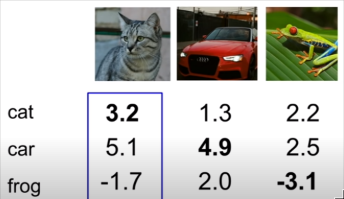

## Image Classification

Distance Metric to compare images

L1 distance: $d_1(I_1,I_2)=\sum_p|I_1^p-I_2^p|$

In Nearest Neighbor classifier, we just memorize all training image, and then find the nearest training image for each testing image, which is the label of testing image. Therefore, with N examples, training need O(1) and predicting need O(N), which is not what we want.

K-nearest neighbors: instead of copying label from nearest neighbor, take **majority vote** from K closest points.

Hyperparameters:choices about the algorithm that we set rather than learn. they are problem-dependent. Try them all and see what works better.

The best way of setting hyperparameters is splitting data into folds, try each fold as validation and average the results. But it is best for small datasets.

## linear classification

### SVM

$$f(x, W) = Wx + b$$

Example: 3 training examples,3 classes. With some W the scores $f(x,W) = Wx$ are: 

**Multiclass SVM loss**:

Given an example $(x_i,y_i)$ where $x_i$ is the image and where $y_i$ is the (integer) label, and using the shorthand for the scores vector: $s = f(x_i,W)$

The SVM loss has the form:

$$L_i=\sum_{j \neq y_i}\max(0,s_j-s_{y_i} + 1)$$

In this example, $L_1 = max(0, 5.1-3.2 + 1) + max(0,-1.7 - 3.2 + 1) = max(0, 2.9) + max(0, -3.9) = 2.9 + 0 = 2.9$

We can also know that $L_2 = 0,L_3 = 12.9$, so the average $L = 5.27$

Q1: What happens to loss if car scores change a bit?

A1: The loss will not change.

Q2: What is the min/max possible loss?

A2: The min is 0, and the max is infinity.

Q3: At initialization W is small so all s \approx 0. What is the loss?

A3；-1

Q4: What if the sum was over all classes?(including $j = y_i$)

A4: The loss increased by 1

Q5: What if we used mean instead of sum?

A5: The answer does not change.

Q6: What if we used $L_i = \sum_{j\neq y_i}max(0,s_j-s_{y_i} + 1)^2$ ?

A6: It is a different classification.

Q7: Suppose that we found a W such that L = 0. Is this W unique?

A7: No

### Softmax

Softmax Classifier is a multinomial logistic regression.

scores = unnormalized log probabilities of the classes.

$$P(Y = k|X = x_i) = \frac{e^{s_k}}{\sum_je^{s_j}},~\text{where}~ s = f(x_i;W)$$

Want to maximize the log likelihood, or (for a loss function) to minimize the negative log likelihood of the correct class:

$$L_i = -\log P(Y = y_i|X = x_i)$$

### Optimization

Random check is a silly way to find the 'bottom of valley', In practice, always use analytic gradient, but check implementation with numerical gradient. This is called a **gradient check**.

#### SGD(Stochastic Gradient Descent)

Full sum expensive when N is large.

Approximate sum using a minibatch of examples 32/64/128 common
